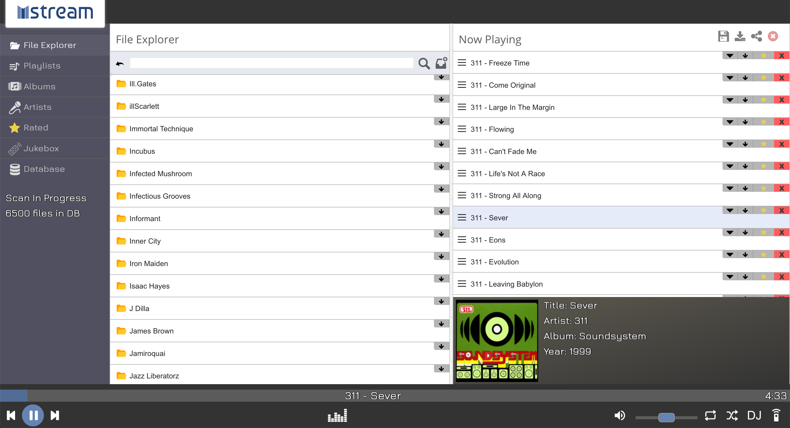

# mstream-docker

> docker 一键部署 mstream 私人云音乐

------

## 概要

你是否面临以下困扰：

- 想听以前某首音乐的时候，网上已经找不到了
- 即使网上找到了，因为版权原因无法在线听、甚至无法下载
- 可以在线听，但是要收费
- 在家、公司、手机都要专门为不同的音乐软件设置同一个曲库
- ......

其实只需要使用 [mStream](https://github.com/IrosTheBeggar/mStream) 搭建一个私人云音乐，这些问题就迎刃而解了：mStream 是采用 NodeJS 编写的，支持 mp3、flac 等多种格式的音乐流媒体服务器，它附带一个 RESTful JSON API 和内置的 Web GUI，可以在任何浏览器上访问您的云歌单。



## 目录结构说明


```
mstream-docker
├── music ....................... [音乐文件只要放到此目录下即可被识别，支持多目录嵌套]
├── config ...................... [mStream 配置目录]
├── docker-compose.yml .......... [mStream 镜像构建脚本]
├── run.sh ...................... [mStream 服务一键启动脚本]
├── stop.sh ..................... [mStream 服务一键停止脚本]
├── imgs ........................ [README 插图目录]
└── README.md ................... [本仓库说明文档]
```

## 环境要求

  


## 部署步骤

### 1. 项目构建

- 宿主机安装 docker、docker-compose
- 宿主机安全组/防火墙（iptables/firewall）放行 9000 端口的入口流量
- 下载仓库： `git clone https://github.com/lyy289065406/mstream-docker /usr/local/mstream-docker`
- 打开仓库目录： `cd /usr/local/mstream-docker`
- 构建镜像并运行： `./run.sh -u admin -p admin123`
- 浏览器访问 [http://127.0.0.1:9000](http://127.0.0.1:9000) 即可使用

> 构建时设置的是 mStream 前端的登录账密


### 2. 导入本地离线音乐

直接把音乐文件放到宿主机的 [`music`](music) 目录，即可在前端的【File Explorer】找到这些音乐文件。

> 因版权关系越来越多音乐难以下载，可以到 [https://www.3esh-online.com/](https://www.3esh-online.com/) 搜索并免费下载音乐，下载后可把音乐文件存储到另一个 Repo（如 [music-library](https://github.com/lyy289065406/music-library)），使用时再通过 git clone 拉取到 [`music`](music) 目录

